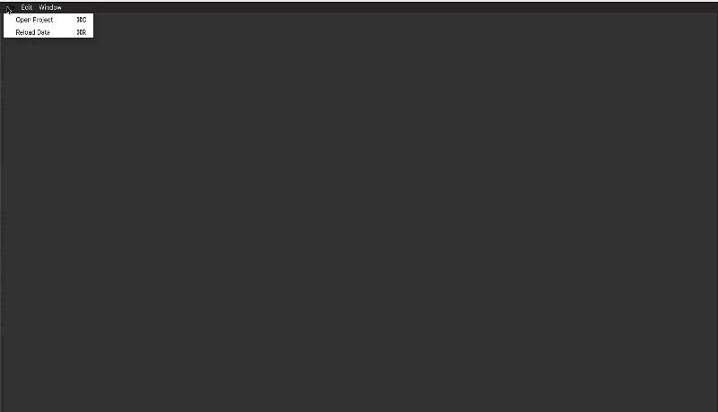

Using the interface
-------------------

Start SNUB from the command line::

    conda activate snub
    snub

Open a project
~~~~~~~~~~~~~~

Open your project by going to ``File > Open Project``, navigate to the project directory, and hitting ``Choose`` with the directory selected. Multiple projects can be opened at once as different tabs. Projects can also be opened by including their paths as command line argument(s)::

   snub /path/to/project1 /path/to/project2

|

Navigate the timeline
~~~~~~~~~~~~~~~~~~~~~

The browser is divided into two sections. The track-stack (on the right below) contains data-views that have time as a dimension, such as heatmaps, trace plots and spike plots. The tracks are always synchronized so that the same horizontal coordinate represents the same point in time. 

* Click/drag to change the current time.
* Use scrolls/gestures to change the visible time window.  
* Use the play button and speed slider at the bottom to watch in real time
* Toggle "center playhead" to keep the current time centered
* Toggle the timeline unit between minutes:seconds and "timestamps". Timesteps are multiples of the ``min_step`` parameters in the projects config file, and can be useful for accessing specific timepoinmts (e.g. video frames) outside of SNUB.

.. image:: ../media/use_case1.gif
   :align: center

|

Plot activity traces
~~~~~~~~~~~~~~~~~~~~

By default, all heatmaps and spike plots are paired with a trace plot (set ``add_traceplot=False`` to override). 

* Right click on any row of the heatmap/spike-plot to view it in the trace plot. 
* View groups of rows in more detail using the vertical zoom and shift buttons in the right-click menu. 

.. image:: ../media/use_case3.gif
   :align: center

|

Use selections
~~~~~~~~~~~~~~

The panel-stack (on the left below) contains data-views such as videos, scatter plots and 3D mesh views. The video panel always displays the current frame and the scatter plot highlights any nodes that represent the current time. A useful way to relate the scatter plot and timeline views is through selections.

* Use shift+drag to select points in the scatter view or intervals in the timeline.
* Use command/control+drag to deselect points and intervals.
* Selections are synchronized across all views.
* Selections can also be used to re-order the rows of a heatmap based on the total activity within the selected interval(s).

.. image:: ../media/use_case2.gif
   :align: center

.. note::
   When shift+drag or command/control+drag are performed over the annotator widget, they will not affect selections, but rather be used to edit the current annotations. 

|

Color the scatter plot
~~~~~~~~~~~~~~~~~~~~~~

Another way to probe the scatter plot is through node coloring.

* Use right-click -> "Color by ..." to view variables of interest in the scatter plot.
* Include variables using ``variables`` and ``variable_labels`` in :py:func:`snub.io.add_scatter`.
* Bring nodes with high values to the top using right-click -> "Sort by color value".

.. image:: ../media/use_case4.gif
   :align: center

|

Annotate videos
~~~~~~~~~~~~~~~

Annotation of videos, e.g., marking the intervals when one or more behaviors occur, can be performed using the annotator widget (see tutorial). The widget is divided into rows corresponding to each annotation label.

* Use shift+drag within a row to add an interval.
* Use command/control+drag within a row to subtract an interval.
* Right click to import or export annotations.