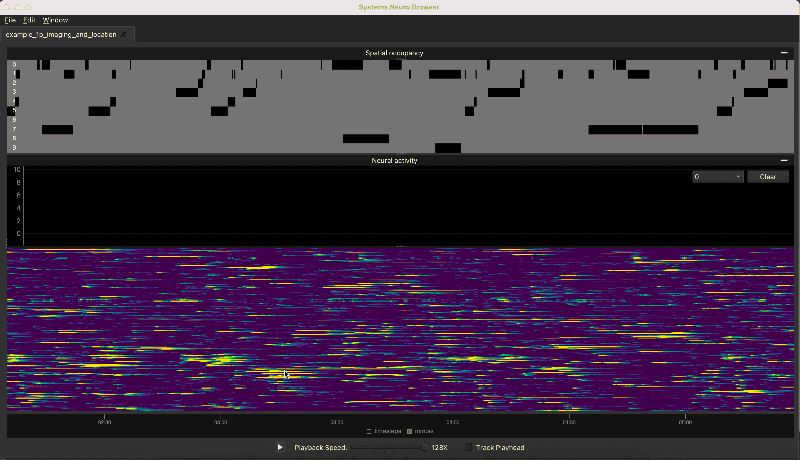

Systems Neuro Browser
================================

**SNUB is a visual interface for time-series data in systems neuroscience.** Using a set of linked views, users can explore relationships between raw video, animal pose, behavior annotations, and neural activity. Some example use cases are shown below below, followed by detailed 

Use Cases
---------

1. Caption blah

.. image:: ../media/use_case1.gif

2. Caption blah

3. Caption blah

.. image:: ../media/use_case3.gif

Installation
------------

Install `Anaconda <https://docs.anaconda.com/anaconda/install/index.html>`_ or `Miniconda <https://docs.conda.io/en/latest/miniconda.html>`_. Create an environment with python≥3.8 and pip install SNUB. 

.. code-block:: console

   conda create -n snub python=3.8
   conda activate snub
   pip install -U git+https://github.com/calebweinreb/SNUB

To test the installation, download the example data and start SNUB by running::

   snub

in a terminal or anaconda prompt (make sure the ``snub`` conda environment is activated). A browser window should launch. Go to ``File > Open Project``,  navigate to one of the example projects, and hit ``Choose`` with the project directory selected. Projects can also be opened by including the path as a command line argument::

   snub /path/to/project/directory

To use SNUB functions in jupyter, execute the following line with the ``snub`` environment active. The environment should then be listed as an option when creating a new notebook or when switching kernels (``Kernel > Change Kernel > snub``)::

   python -m ipykernel install --user --name=snub

Loading Data
------------

The ``snub.io`` module provides a set of functions for creating a new project and saving common types of data. For example, the following code creates a new project with paired electrophysiology and video data. For other data types and additional options, see the snub.io documentation. 

.. code-block:: python

   import snub.io

   project_directory = 'path/to/new/project'

   snub.io.create_project(project_directory, duration=1800)
   snub.io.add_video(project_directory, 'path/to/my_video.avi', name='IR_camera')
   snub.io.add_ephys(ephys_data) # ephys_data is a list of spike times for each unit

Another option is to create a SNUB project manually. Each project is simply a directory with data and a ``config.json`` file. The config file contains a set of global parameters and list of desired data-views, such as videos, raster plots, or scatter splots. See below for a full list of available data-views. 

.. toctree::
   :maxdepth: 2

   setup

Browser Guide
-------------

.. toctree::
   :maxdepth: 2

   usage

Developer API
-------------

.. toctree::
   :maxdepth: 2

   api

